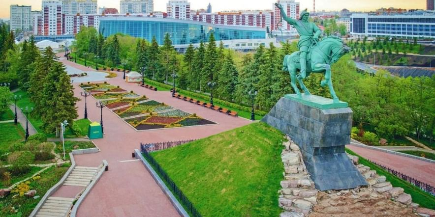
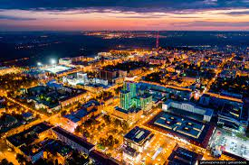

<html>
<head>
<title> Сайт "Мой родной город"
</title>
</head>
<body bgcolor="#FFDEAD">
<h1> 
<b> 
Мой родной город - Уфа  
 

<h2>
<b> 
 Главная  

 
<b>Уфа</b> - город-миллионник в России, столица Республики  Башкортостан, 
административный центр Уфимского района, в состав которого не входит. 
 
Город республиканского значения, образует муниципальное образование город Уфа со 
статусом городского округа. 
 Центр Уфимской агломерации. 
 Входит в число крупнейших 
экономических, культурных и научных центров Российской Федерации.

 
<right>

